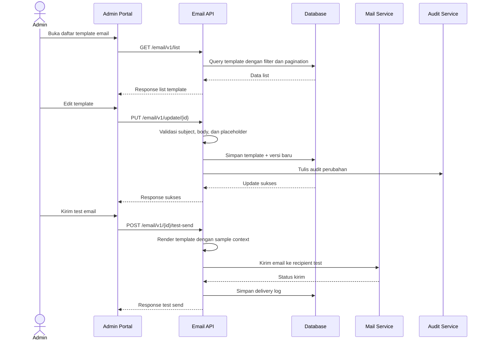
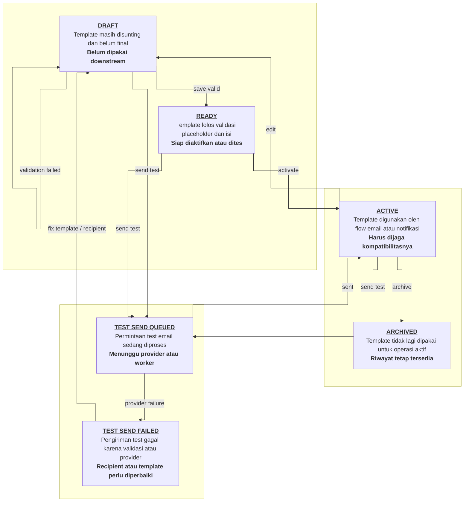

# Email

## Objective Overview

`Email` adalah fitur untuk mengelola template email yang dipakai sistem, termasuk melihat daftar template, membuka detail, mengubah konten subject/body, melakukan preview, dan mengirim test email.

Tujuan bisnis utamanya adalah memastikan tim operasional atau admin bisa mengelola konten email secara terkontrol sebelum dipakai oleh flow notifikasi atau delivery eksternal. Dari sisi backend, fitur ini harus menjaga validasi placeholder, versi template, status aktif, dan log pengiriman test.

## Ringkasan Alur & Cara Kerja Sistem

User membuka daftar template email dan backend mengembalikan data template yang sudah dipaginasi, bisa difilter berdasarkan keyword, kategori, atau status.

Saat template dibuka, backend mengembalikan detail lengkap berupa subject, body HTML atau markdown, variabel placeholder yang diizinkan, dan metadata versi. Jika user mengubah template, backend memvalidasi bahwa seluruh placeholder yang dipakai masih terdaftar dan tidak ada token yang tidak dikenali.

Sebelum template dipakai di produksi, user dapat melakukan preview dan mengirim test email. Preview menghasilkan hasil rendering berdasarkan sample data atau context dummy, sedangkan test send membuat job pengiriman ke alamat tujuan yang diinput user. Backend harus menyimpan log test send agar hasil pengiriman bisa ditelusuri saat gagal.

Jika template diupdate, sistem sebaiknya menyimpan versi baru atau riwayat perubahan supaya rollback atau audit dapat dilakukan bila konten terbaru bermasalah.

## Business Rules

1. Hanya user berwenang yang boleh mengelola email template.
2. Subject email wajib diisi dan tidak boleh kosong setelah trimming.
3. Body template wajib diisi dan harus bisa dirender dengan engine yang disepakati.
4. Placeholder atau variable yang dipakai di body harus berasal dari daftar variable yang valid.
5. Preview harus memakai sample context yang aman, bukan data sensitif production.
6. Template yang sudah `ACTIVE` boleh diupdate, tetapi perubahan harus menghasilkan riwayat versi atau audit yang jelas.
7. Jika template dipakai oleh flow notifikasi atau campaign, update besar harus memperhatikan kompatibilitas placeholder.
8. Test email hanya boleh dikirim ke recipient yang valid dan, bila perlu, domain yang diizinkan oleh kebijakan keamanan.
9. Email delivery log harus menyimpan status pengiriman dan error yang relevan.
10. Jika pengiriman test memakai job async, status job harus bisa ditanyakan ulang sampai final.
11. List template harus mendukung search, filter status, dan pagination.
12. Soft delete atau archive lebih aman daripada delete keras jika template pernah dipakai downstream.

## Table Design

### `email_templates`

Purpose: menyimpan master template email yang bisa diedit dan dipakai oleh flow lain.

| Field | Type | Constraint | Notes |
| --- | --- | --- | --- |
| `id` | `UUID` | PK | Primary identifier |
| `template_code` | `VARCHAR(100)` | NOT NULL, UNIQUE | Kode template |
| `name` | `VARCHAR(150)` | NOT NULL | Nama template |
| `subject` | `VARCHAR(255)` | NOT NULL | Subject email |
| `body_content` | `TEXT` | NOT NULL | Isi template HTML/markdown |
| `template_format` | `VARCHAR(30)` | NOT NULL | `HTML`, `MARKDOWN`, atau format lain |
| `status` | `VARCHAR(30)` | NOT NULL | `DRAFT`, `ACTIVE`, `ARCHIVED` |
| `version_number` | `INT` | NOT NULL | Versi template |
| `last_preview_at` | `TIMESTAMP WITH TIME ZONE` | NULLABLE | Waktu preview terakhir |
| `created_at` | `TIMESTAMP WITH TIME ZONE` | NOT NULL | Audit timestamp |
| `updated_at` | `TIMESTAMP WITH TIME ZONE` | NOT NULL | Audit timestamp |
| `created_by` | `UUID` | NULLABLE | Actor pembuat |
| `updated_by` | `UUID` | NULLABLE | Actor update terakhir |
| `deleted_at` | `TIMESTAMP WITH TIME ZONE` | NULLABLE | Soft delete marker |

### `email_template_variables`

Purpose: menyimpan daftar placeholder yang valid untuk template tertentu.

| Field | Type | Constraint | Notes |
| --- | --- | --- | --- |
| `id` | `UUID` | PK | Primary identifier |
| `template_id` | `UUID` | NOT NULL, FK | Referensi ke `email_templates.id` |
| `variable_key` | `VARCHAR(100)` | NOT NULL | Contoh: `{{full_name}}` |
| `description` | `VARCHAR(255)` | NULLABLE | Penjelasan variable |
| `is_required` | `BOOLEAN` | NOT NULL, DEFAULT `false` | Wajib dipenuhi saat render |
| `created_at` | `TIMESTAMP WITH TIME ZONE` | NOT NULL | Audit timestamp |

### `email_template_versions`

Purpose: menyimpan riwayat versi template agar perubahan dapat ditelusuri dan di-rollback.

| Field | Type | Constraint | Notes |
| --- | --- | --- | --- |
| `id` | `UUID` | PK | Primary identifier |
| `template_id` | `UUID` | NOT NULL, FK | Referensi template |
| `version_number` | `INT` | NOT NULL | Nomor versi |
| `subject` | `VARCHAR(255)` | NOT NULL | Snapshot subject |
| `body_content` | `TEXT` | NOT NULL | Snapshot body |
| `change_note` | `TEXT` | NULLABLE | Catatan perubahan |
| `created_at` | `TIMESTAMP WITH TIME ZONE` | NOT NULL | Waktu versi dibuat |
| `created_by` | `UUID` | NULLABLE | Actor pembuat versi |

### `email_delivery_logs`

Purpose: menyimpan log pengiriman email termasuk test email dan hasil delivery.

| Field | Type | Constraint | Notes |
| --- | --- | --- | --- |
| `id` | `BIGINT` | PK | Surrogate key |
| `template_id` | `UUID` | NULLABLE, FK | Template yang dipakai |
| `recipient_email` | `VARCHAR(255)` | NOT NULL | Tujuan email |
| `delivery_type` | `VARCHAR(30)` | NOT NULL | `TEST`, `TRANSACTIONAL`, `BULK` |
| `status` | `VARCHAR(30)` | NOT NULL | `QUEUED`, `SENT`, `FAILED` |
| `provider_message_id` | `VARCHAR(255)` | NULLABLE | ID dari SMTP atau provider |
| `error_message` | `TEXT` | NULLABLE | Pesan error bila gagal |
| `rendered_subject` | `VARCHAR(255)` | NULLABLE | Subject hasil render |
| `rendered_body` | `TEXT` | NULLABLE | Body hasil render |
| `sent_at` | `TIMESTAMP WITH TIME ZONE` | NULLABLE | Waktu kirim |
| `created_at` | `TIMESTAMP WITH TIME ZONE` | NOT NULL | Audit timestamp |

## Sequence Diagram



## State Diagram



## API Contract

### Get Email Template List

- URL: `GET /email/v1/list`
- Method: `GET`
- Auth: `Bearer Token`
- Query Params:
  - `search` keyword opsional
  - `status` opsional
  - `page` opsional, default `1`
  - `limit` opsional, default `10`
- Validation:
  - pagination harus positif
  - status harus dikenal bila dikirim
- Success Response:

```json
{
  "status": {
    "code": "EML20000",
    "message": "Email template list fetched successfully."
  },
  "data": [
    {
      "id": "uuid-1",
      "templateCode": "WELCOME-01",
      "name": "Welcome Email",
      "subject": "Welcome to the platform",
      "status": "ACTIVE",
      "versionNumber": 3
    }
  ],
  "meta": {
    "page": 1,
    "limit": 10,
    "totalItems": 1,
    "totalPages": 1
  }
}
```

- Negative Cases:
- `400` Invalid filter

  Example response:

```json
{
  "status": {
    "code": "EML40001",
    "message": "Invalid filter."
  },
  "data": null
}
```

### Get Email Template Detail

- URL: `GET /email/v1/detail/{id}`
- Method: `GET`
- Auth: `Bearer Token`
- Path Params:
  - `id` template identifier
- Validation:
  - template harus ada
- Success Response:

```json
{
  "status": {
    "code": "EML20001",
    "message": "Email template detail fetched successfully."
  },
  "data": {
    "id": "uuid-1",
    "templateCode": "WELCOME-01",
    "name": "Welcome Email",
    "subject": "Welcome to the platform",
    "bodyContent": "<p>Hello {{full_name}}</p>",
    "templateFormat": "HTML",
    "status": "DRAFT",
    "versionNumber": 3,
    "variables": [
      {
        "variableKey": "{{full_name}}",
        "description": "Recipient full name",
        "isRequired": true
      }
    ]
  }
}
```

- Negative Cases:
- `404` Template not found

  Example response:

```json
{
  "status": {
    "code": "EML40401",
    "message": "Email template not found."
  },
  "data": null
}
```

### Update Email Template

- URL: `PUT /email/v1/update/{id}`
- Method: `PUT`
- Auth: `Bearer Token`
- Path Params:
  - `id` template identifier
- Request Body:

```json
{
  "subject": "Welcome to the platform",
  "bodyContent": "<p>Hello {{full_name}}</p>",
  "templateFormat": "HTML",
  "changeNote": "Update greeting copy"
}
```

- Validation:
  - subject wajib
  - bodyContent wajib
  - placeholder harus valid
  - format template harus dikenal
- Success Response:

```json
{
  "status": {
    "code": "EML20002",
    "message": "Email template updated successfully."
  },
  "data": {
    "id": "uuid-1",
    "status": "DRAFT",
    "versionNumber": 4
  }
}
```

- Negative Cases:
- `400` Invalid placeholder

  Example response:

```json
{
  "status": {
    "code": "EML40002",
    "message": "Invalid placeholder."
  },
  "data": null
}
```

- `404` Template not found

  Example response:

```json
{
  "status": {
    "code": "EML40401",
    "message": "Email template not found."
  },
  "data": null
}
```

### Send Test Email

- URL: `POST /email/v1/{id}/test-send`
- Method: `POST`
- Auth: `Bearer Token`
- Path Params:
  - `id` template identifier
- Request Body:

```json
{
  "recipientEmail": "test@example.com",
  "sampleData": {
    "full_name": "John Doe"
  }
}
```

- Validation:
  - recipientEmail wajib dan format email valid
  - template harus ada
  - sampleData harus cukup untuk render placeholder wajib
- Success Response:

```json
{
  "status": {
    "code": "EML20200",
    "message": "Test email queued successfully."
  },
  "data": {
    "deliveryLogId": 1001,
    "status": "QUEUED"
  }
}
```

- Negative Cases:
- `400` Invalid recipient email

  Example response:

```json
{
  "status": {
    "code": "EML40003",
    "message": "Invalid recipient email."
  },
  "data": null
}
```

- `409` Template render failed

  Example response:

```json
{
  "status": {
    "code": "EML40901",
    "message": "Template render failed."
  },
  "data": null
}
```

### Get Delivery Log Detail

- URL: `GET /email/v1/delivery-log/{id}`
- Method: `GET`
- Auth: `Bearer Token`
- Path Params:
  - `id` delivery log identifier
- Validation:
  - delivery log harus ada
- Success Response:

```json
{
  "status": {
    "code": "EML20003",
    "message": "Delivery log fetched successfully."
  },
  "data": {
    "id": 1001,
    "recipientEmail": "test@example.com",
    "deliveryType": "TEST",
    "status": "SENT",
    "providerMessageId": "msg-123"
  }
}
```

- Negative Cases:
- `404` Delivery log not found

  Example response:

```json
{
  "status": {
    "code": "EML40402",
    "message": "Delivery log not found."
  },
  "data": null
}
```

## Table Status Code

| HTTP Status | Internal Code | Title | Description |
| --- | --- | --- | --- |
| 200 | `EML20000` | List Success | Email template list berhasil diambil. |
| 200 | `EML20001` | Detail Success | Detail template berhasil diambil. |
| 200 | `EML20002` | Update Success | Template berhasil diupdate. |
| 200 | `EML20003` | Delivery Log Success | Delivery log berhasil diambil. |
| 202 | `EML20200` | Test Send Queued | Test email berhasil diantrikan. |
| 400 | `EML40001` | Invalid Filter | Filter list tidak valid. |
| 400 | `EML40002` | Invalid Placeholder | Placeholder template tidak valid. |
| 400 | `EML40003` | Invalid Recipient | Alamat recipient tidak valid. |
| 404 | `EML40401` | Template Not Found | Template email tidak ditemukan. |
| 404 | `EML40402` | Delivery Log Not Found | Delivery log tidak ditemukan. |
| 409 | `EML40901` | Render Failed | Render template gagal. |

## Assumptions

1. `Email` di sini diasumsikan sebagai fitur manajemen template dan test send, bukan inbox client atau email composer penuh.
2. Body template dapat disimpan dalam HTML atau markdown, tergantung engine yang dipakai backend.
3. Test send boleh diproses async agar perilaku backend tetap aman saat provider email lambat.
4. Kalau nanti ada approval flow sebelum template active, lifecycle ini bisa diperluas tanpa mengubah struktur besar dokumen.
